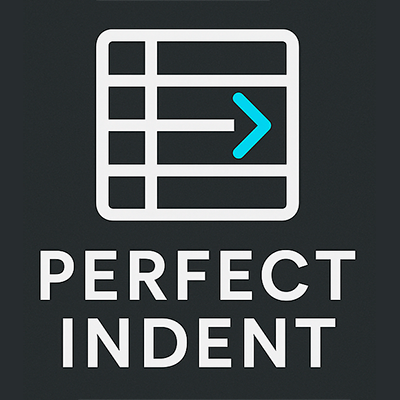

# Perfect Indent

A smarter indentation fixer for Visual Studio Code.

Perfect Indent analyzes your code structure and automatically corrects broken indentation for ANY language.

## ⭐ Features

- Fix indentation with one command  

- Detects tab/spaces automatically  

- Works with HTML, JS, TS, Vue, React, PHP, Python, JSON, etc.  

- Smart block-based indentation  

- Keyboard shortcut included  

- Ultra lightweight (no dependencies)

## 🚀 Usage

Press:

- **Ctrl + Shift + I** (Windows/Linux)  

- **Cmd + Shift + I** (macOS)

or run:

**Perfect Indent: Fix indentation**

## 💡 Perfect for

- Messy pasted code  

- Minified → reformatted  

- HTML/Blade/Vue/JSX components  

- Python blocks  

- Legacy files

## 🛠️ Roadmap

### v1.0

✔ Fix básico por blocos

✔ Detectar indent

✔ Comando atalho

### v1.1

⬜ Ativar "Fix on Save"

⬜ Configurações no VS Code

⬜ Suporte especial para Python

### v1.2

⬜ Indentação inteligente por AST (análise da estrutura)

### v2.0

⬜ "AI Indent Helper" (opcional, offline ou com IA local)

⬜ Corrigir indentação por seleção

---

Made with ❤️ for developers.
